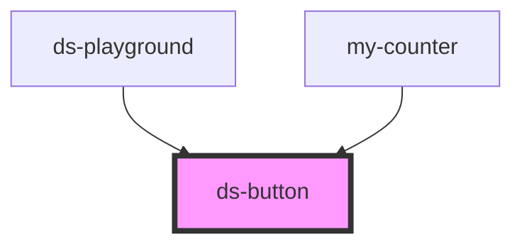

# ds-button

<!-- Auto Generated Below -->

## Properties

| Property      | Attribute     | Description | Type      | Default     |
| ------------- | ------------- | ----------- | --------- | ----------- |
| `compact`     | `compact`     |             | `boolean` | `undefined` |
| `dense`       | `dense`       |             | `boolean` | `undefined` |
| `disabled`    | `disabled`    |             | `boolean` | `undefined` |
| `interactive` | `interactive` |             | `boolean` | `undefined` |
| `raised`      | `raised`      |             | `boolean` | `undefined` |
| `stroked`     | `stroked`     |             | `boolean` | `undefined` |
| `unelevated`  | `unelevated`  |             | `boolean` | `undefined` |

## Dependencies

### Used by

 - [ds-playground](../ds-playground)
 - [my-counter](../my-counter)

### Graph

----------------------------------------------

*Built with [StencilJS](https://stenciljs.com/)*
