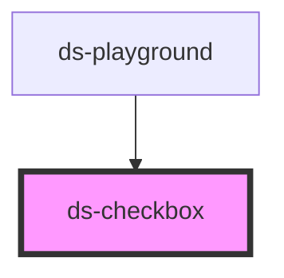

# ds-checkbox

<!-- Auto Generated Below -->

## Properties

| Property        | Attribute       | Description | Type      | Default     |
| --------------- | --------------- | ----------- | --------- | ----------- |
| `checked`       | `checked`       |             | `boolean` | `undefined` |
| `controlId`     | `control-id`    |             | `string`  | `undefined` |
| `disabled`      | `disabled`      |             | `boolean` | `undefined` |
| `indeterminate` | `indeterminate` |             | `boolean` | `undefined` |

## Dependencies

### Used by

 - [ds-playground](../ds-playground)

### Graph

----------------------------------------------

*Built with [StencilJS](https://stenciljs.com/)*
