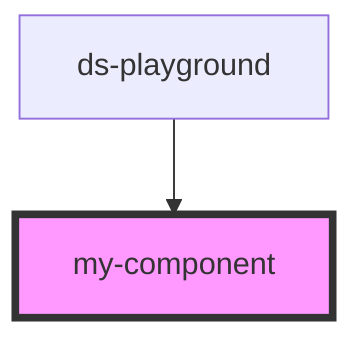

# my-component

<!-- Auto Generated Below -->

## Properties

| Property | Attribute | Description     | Type     | Default     |
| -------- | --------- | --------------- | -------- | ----------- |
| `first`  | `first`   | The first name  | `string` | `undefined` |
| `last`   | `last`    | The last name   | `string` | `undefined` |
| `middle` | `middle`  | The middle name | `string` | `undefined` |

## Dependencies

### Used by

 - [ds-playground](../ds-playground)

### Graph

----------------------------------------------

*Built with [StencilJS](https://stenciljs.com/)*
